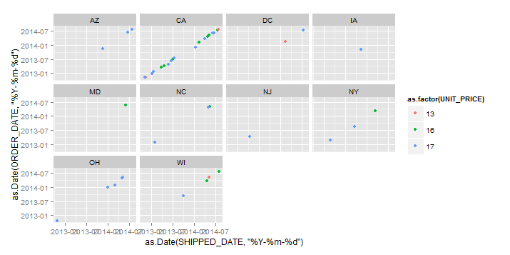
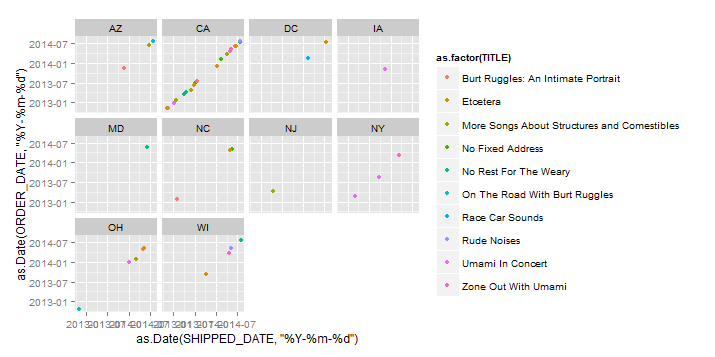
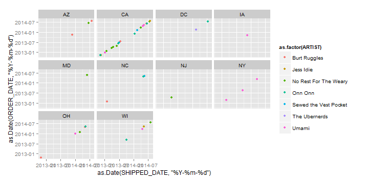

Project Requirements<http://www.cs.utexas.edu/~cannata/dataVis/Projects/R%20Project%201/R%20Project%20Requirements.html>.

5.Using KnitR, build an html file that documents the steps to reproduce your project. Use this html file to present a visual story about your data and what you discovered about your data using visualization techniques.

This is an R Markdown document. Markdown is a simple formatting syntax for authoring HTML, PDF, and MS Word documents. 

6.Build data frames for each of the 4 tables in the Orders Schema. 

```{r}
library("RCurl")
source("../01 Data/dataframes.R", echo = TRUE)
```
Explain the saved output.

7. Display these data frames in the KnitR document.

```{r}
df1 # R data frame fot the customers table
df2 # R data frame fot the items table
df3 # R data frame fot the orders table
df4 # R data frame fot the order_details table
```

Explain each ggplot for the data frames

8.Produce an interesting plot for each data frame.


```{r, echo=FALSE}
library("ggplot2")
source("../02 Visualizations/ggplot.R", echo = TRUE)
```

Note that the `echo = FALSE` parameter was added to the code chunk to prevent printing of the R code that generated the plot.

Explain the plots:

10.Produce the following plots and document the R used to produce them.


```{r, echo=FALSE}
source("../02 Visualizations/ggplot1.R", echo = TRUE)
```






